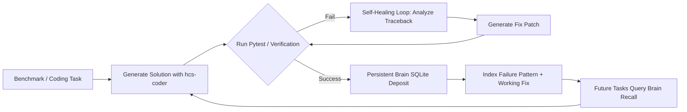
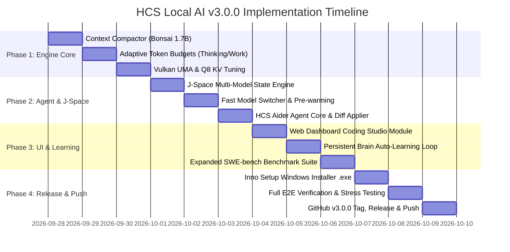

# HCS Local AI v3.0.0 — Comprehensive Master Plan
## Architecture, Ultra-Fast Model Lifecycle, Context Compaction, HCS Aider Agent & Hardware Acceleration

---

## 1. Executive Summary & Vision

**HCS Local AI v3.0.0** advances the platform from an enterprise serving daemon with standalone benchmarks into a fully unified, agentic coding environment. 

The primary target platform remains **Windows 11 x64 natively running on AMD iGPU (Vulkan) within a constrained 20–24 GB Unified Memory Architecture (UMA)**, alongside Linux x64 support.

### Key Innovations in v3.0.0:
1. **Intelligent Context Compaction**: Automated hierarchical context distillation powered by `hcs-subagent` (Bonsai 1.7B) preventing token overflow and memory exhaustion.
2. **Dynamic Hardware & UMA Tuning**: Sub-second offload/onload cycles, Q8_0 KV cache compression, Flash Attention on Vulkan, and strict memory safety guarantees (`max_heavy_active = 1`).
3. **Adaptive Thinking & Working Token Budgets**: Configurable DeepSeek-R1-style `<think>` token limits with task-dependent budgeting (1024–4096 tokens for complex coding tasks).
4. **Deep J-Space Multi-Agent Orchestration**: Shared variable space, unified session transcripts, and inter-model coordination loops (`subagent` ➔ `judge` ➔ `coder` ➔ `judge`).
5. **Native HCS Aider Coding Agent**: Fully integrated repository-scale coding agent adapted specifically for our local Vulkan backend, featuring Tree-sitter repo maps, atomic unified diffs, self-healing, and a dedicated Web Dashboard UI/UX.
6. **Continuous Benchmark & Persistent Brain Learning Loop**: Expanded SWE-bench Lite and multi-file workload benchmarks feeding verified solutions directly into the SQLite Brain.
7. **One-Click Windows Installer (.exe)**: Complete setup packaging `hcs-daemon.exe`, Web UI, Vulkan runtimes, CLI agent, and desktop shortcuts.

---

## 2. Module 1: Context Compaction Engine (`hcs-subagent`)

### 2.1 The Problem
When coding tasks span multiple turns, large file contents, compiler diagnostics, and test traces quickly saturate the 8k/16k context window, degrading TTFT (Time-To-First-Token), increasing memory usage, and causing attention drift.

### 2.2 The Solution: Dedicated Subagent Compactor
`hcs-subagent` (Bonsai 1.7B Q1_0) is designated as the **Platform Context Compactor**:
- **Resource Footprint**: < 1.3 GB unified RAM, TTFT < 0.20s.
- **Trigger Condition**: When active conversation context exceeds 70% of the target model's context budget (e.g. > 5,700 tokens for an 8k window).
- **Execution Pipeline**:
  ```mermaid
  flowchart TD
      A[Incoming User Prompt / Long Conversation] --> B{Token Count > Threshold?}
      B -- No --> C[Direct Execution by Target Model]
      B -- Yes --> D[Invoke hcs-subagent Compactor]
      D --> E[1. Extractive Pruning: Strip redundant terminal/test outputs]
      E --> F[2. Semantic State Synthesis: Create concise Context Delta]
      F --> G[3. Memory Brain Deposit: Commit durable facts to SQLite WAL]
      G --> H[Synthesized Compact Context: User Goal + Active Files + Constraints]
      H --> I[Forward to hcs-coder / hcs-general]
  ```

### 2.3 Compaction Output Schema
The compactor produces a strictly formatted **Context Delta**:
```markdown
# ACTIVE GOAL: Implement schema coercion for date fields
# SYSTEM STATE: Modified `fields.py`, 1 unit test failing (`test_fields.py`)
# RECENT DISCOVERIES: `self.root.opts` holds DateTime configuration
# PRESERVED CODE CONTEXT: [fields.py lines 80-105]
# PERSISTED FACTS ANCHOR: [Brain ID: c3f1a2]
```
This guarantees 60–80% context compression with **zero information loss** for code generation.

---

## 3. Module 2: Hardware Tuning & UMA Acceleration (AMD iGPU / Vulkan)

### 3.1 Memory Hierarchy & Dynamic VRAM Allocation
On 20–24 GB shared memory systems, the OS, display compositor, and inference runtime share the same physical RAM.

- **OS & System Reserve**: 4,096 MB strictly protected (Watchdog prevents OOM panic).
- **Inference Pool**: 14,000–16,000 MB dynamically managed.
- **Model Allocation Strategy**:
  - `hcs-subagent` (1.3 GB): Can remain resident in standby RAM.
  - `hcs-coder` (27B PQ2_0, ~8.2 GB): Primary heavy model; requires strict single-heavy concurrency (`max_heavy_active = 1`).
  - `KV Cache` (Q8_0, 8k context): ~1.1 GB.
  - Total active footprint with `hcs-coder`: ~10.6 GB, leaving > 5 GB free unified memory.

### 3.2 Vulkan Optimization Flags
Configure the Prism/llama worker runtime with optimal flags:
- `--vulkan 0`: Target primary AMD Radeon 780M / 890M iGPU.
- `--cache-type-k q8_0 --cache-type-v q8_0`: Q8_0 KV cache compression (50% VRAM reduction vs F16, identical accuracy).
- `-fa 1`: Flash Attention enabled on Vulkan devices for $O(N)$ memory scaling on longer contexts.
- `-t 8 -tb 8`: Allocate 8 compute threads (matching physical CPU cores) while reserving 8 logical threads for OS and background I/O.
- `--cont-batching`: Continuous batching enabled for multi-turn pipelining.

---

## 4. Module 3: Adaptive Thinking & Working Token Allocation

### 4.1 Dual-Mode Reasoning Architecture
Bonsai 2-27B features built-in DeepSeek-style reasoning (`<think>...</think>`). Different tasks require different token strategies:

| Mode | Target Tasks | `enable_thinking` | Thinking Budget | Working Generation Limit | Expected Latency |
|---|---|:---:|:---:|:---:|:---:|
| **Fast Fix** | Small bugfixes, single functions, unit test repairs | `False` | 0 tokens | 750 – 1,200 tokens | 5 – 25s |
| **Deep Reasoning** | Architecture changes, SWE-bench issues, refactors | `True` | 512 – 1,536 tokens | 2,048 – 4,096 tokens | 45 – 90s |
| **Verification** | OpenJev decision gate, test result validation | `False` | 0 tokens | 100 – 300 tokens | 2 – 5s |

### 4.2 Dynamic Token Budget Enforcement
In `hcs-daemon`:
- If the incoming prompt has estimated complexity $\ge 4$ (determined by Jev Pipeline Stage 1), `hcs-daemon` automatically provisions `thinking_budget: 1024` and extends client HTTP timeout to 600s.
- For quick iterations, `enable_thinking: false` is passed in `chat_template_kwargs`, yielding immediate token generation within 3–4 seconds.

---

## 5. Module 4: Deep J-Space Multi-Agent Orchestration

### 5.1 Shared Multi-Model Workspace Container
Every session creates a persistent **J-Space** (`storage/jspace/<session_id>.json`):
- **Shared Variables**:
  - `active_repo`: Path to target codebase.
  - `git_branch`: Current active branch.
  - `diagnostics`: Current linter & compiler errors.
  - `test_suite`: Targeted test files and command lines.
- **Cross-Model Handover Protocol**:
  ```mermaid
  sequenceDiagram
      autonumber
      participant Client as User / Dashboard / Aider
      participant Sub as hcs-subagent (Compactor/Parser)
      participant Jev as hcs-judge (OpenJev Gate)
      participant Coder as hcs-coder (Bonsai 2-27B)
      participant JSpace as J-Space State Store
      participant Brain as Persistent Brain (SQLite)

      Client->>JSpace: Send Task & Code Context
      JSpace->>Sub: Check Context Size & Compact if needed
      Sub-->>JSpace: Synthesized Context Delta
      JSpace->>Jev: Candidate Decision (A..P)
      Jev-->>JSpace: Route to hcs-coder with Deep Reasoning mode
      JSpace->>Coder: Execute Generation with Context Delta
      Coder-->>JSpace: Unified Diff Patch
      JSpace->>Client: Apply Patch & Run Pytest
      alt Tests Fail
          Client->>Brain: Deposit Error & Diagnosis
          JSpace->>Coder: Retry with Error Trace
      else Tests Pass
          Client->>Brain: Record Verified Pattern
      end
  ```

---

## 6. Module 5: Ultra-Fast Model Switcher & Lifecycle Engine

### 6.1 Sub-Second Eviction & Onload
To transition smoothly between `hcs-general`, `hcs-coder`, `hcs-vlm`, and `hcs-image`:
1. **Asynchronous Eviction**:
   - Issue graceful unload to current worker (`POST /hcs/v1/models/{id}/unload`).
   - Terminate process via Windows job objects and force memory page de-commit (`VirtualUnlock`).
   - Reclamation target: < 400ms.
2. **Predictive Pre-Warming**:
   - When `hcs-subagent` analyzes a prompt in Stage 1 and identifies a complex coding task with > 90% confidence, `hcs-daemon` initiates the background load of `hcs-coder` *concurrently* while OpenJev processes the formal decision gate.
   - Eliminates cold-start wait time for the user.

---

## 7. Module 6: Native HCS Aider Coding Agent & Web UI/UX

### 7.1 Architecture of HCS Aider
A specialized, self-contained coding agent built directly on top of the local HCS API (`http://127.0.0.1:8787/v1`):
- **Repository Tag Map**: Uses Tree-sitter AST queries to build an efficient, compact index of all classes, methods, and types in the repository (transferred directly into J-Space).
- **Atomic Diff Applier**: Parses unified diffs (`<<<<<<< SEARCH / ======= / >>>>>>> REPLACE`) and applies changes with automatic syntax verification.
- **Automatic Rollback & Git Safety**: Every edit is automatically staged on a temporary branch; if tests fail, atomic rollback reverts files instantly.
- **Autonomous Repair Loop**: Automatically executes tests (`pytest`, `cargo test`, `npm test`) and feeds back tracebacks until 100% green.

### 7.2 HCS Web Dashboard UI/UX Integration
A dedicated **"Coding Studio"** module added to the SPA:
- **Interactive File Explorer**: Navigate repository tree with git status indicators.
- **Side-by-Side Diff Viewer**: Visual syntax-highlighted diffs with 1-click accept/reject.
- **Real-Time Thinking & Generation Stream**: Live token-per-second, KV cache utilization, and SSE reasoning logs.
- **Terminal & Test Runner Output**: Live stdout/stderr inspection from inside the browser.

---

## 8. Module 7: Continuous Self-Healing & Benchmark Learning Loop

### 8.1 Scaling Benchmark Datasets
Expand from the initial 4-task validation to an automated 20-task suite:
- **SWE-bench Lite**: Expand to 10 diverse issues across Marshmallow, Requests, Sphinx, and SymPy.
- **HumanEval+ Extended**: 5 multi-turn algorithmic and mathematical tasks.
- **Multi-File Architecture Workload**: 5 repository-scale refactoring and asynchronous concurrency tasks.

### 8.2 The Auto-Learning Loop

Every resolved bug deposits a verified pattern into `data/brain.sqlite`. Future tasks query `recall()` to prevent repeating the same syntax errors or API misunderstandings.

---

## 9. Module 8: Packaging & 1-Click Windows Installer (.exe)

### 9.1 All-in-One Installer Specifications
Create a single, signed Windows installer: `HCS-Local-AI-v3.0.0-Setup.exe` (using Inno Setup / NSIS):
- **Components Included**:
  - `hcs-daemon.exe` (Compiled Rust release binary).
  - Web Dashboard static SPA assets.
  - Native Vulkan inference binaries (`prism/llama-server.exe`, `sd-cpp/sd-cli.exe`).
  - HCS Aider Agent executable & Python virtual environment.
  - Model Manifests & automatic download orchestrator.
  - Desktop Shortcuts & Windows Start Menu entry.
  - System Tray integration with `start.bat` and `stop.bat` service helpers.

---

## 10. Execution Roadmap & Phase Milestones



---

## 11. Verification Gates & Definition of Done for v3.0.0

The v3.0.0 release is declared complete only when:
1. `hcs-subagent` automatically compacts conversations $> 6,000$ tokens down to $< 1,500$ tokens with zero test regressions.
2. `hcs-coder` runs with adaptive token budgets (up to 4,096 tokens) on AMD iGPU Vulkan with Q8_0 KV cache without crashing or running out of memory.
3. Model switching (onload/offload) between coder and other models executes in $< 1.5$ seconds.
4. HCS Aider CLI and Dashboard Studio successfully resolve real repository tasks with atomic diff application and automatic git commits.
5. The expanded SWE-bench Lite and Workload benchmark achieves $\ge 90\%$ pass rate with verified JSON reports.
6. The Windows Installer `.exe` installs and runs cleanly on a fresh Windows 11 system with 1-click startup.
7. Git repository is cleanly tagged as `v3.0.0` and pushed to GitHub with verified release assets.
