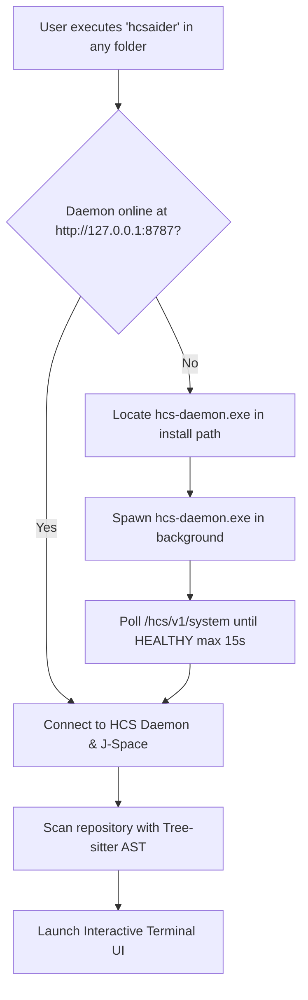
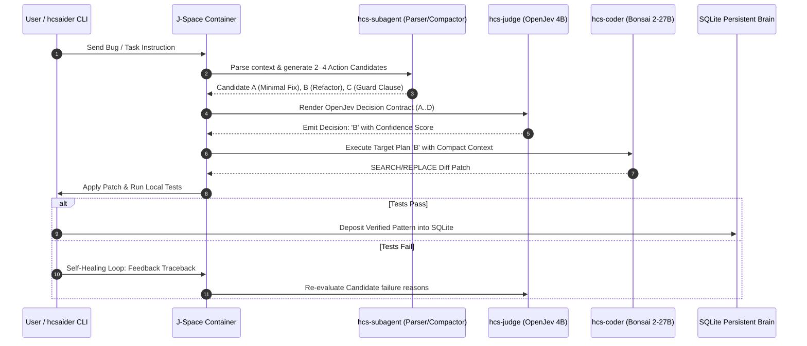
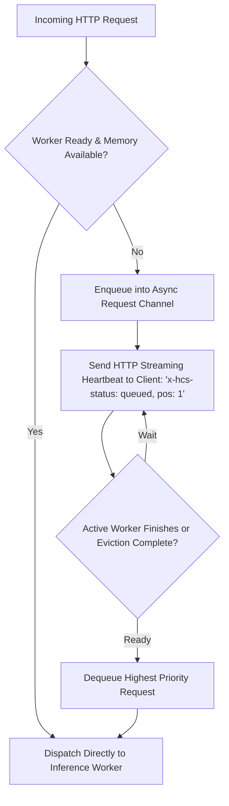
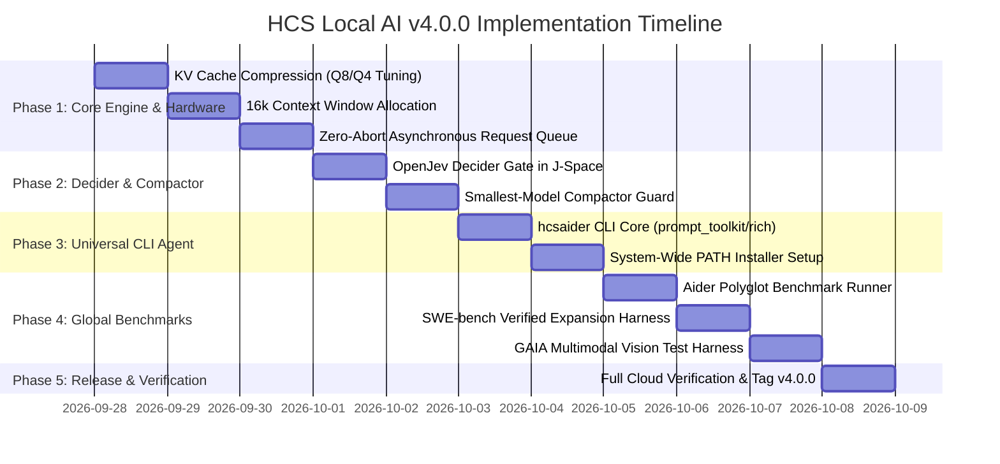

# HCS Local AI v4.0.0 — Next-Gen Autonomous Coding Architecture & Agentic Benchmark Master Plan
## System-Wide `hcsaider` CLI, Deep J-Space Decider Gate, Compressed KV Cache (16k Context), Zero-Abort Queue & Global Benchmark Suite

---

## 1. Executive Summary & Vision

**HCS Local AI v4.0.0** elevates the platform from an enterprise local serving daemon into an end-to-end, system-wide autonomous software engineering powerhouse.

While **v3.0.0** resolved critical memory stability, introduced the `hcs-subagent` context compactor, established initial J-Space coordination, and packaged the Windows release, **v4.0.0** delivers:

1. **System-Wide `hcsaider` CLI**: A universally callable terminal command (`hcsaider`) that operates in **any folder or Git repository**, automatically detecting and booting the local daemon if offline, featuring a rich terminal UI (`prompt_toolkit` + `rich`), slash commands, tab-completion, and atomic rollback.
2. **Deep J-Space Decider Gate (`hcs-judge` OpenJev 4B)**: Formal candidate generation and single-token A..P decision routing integrated directly into J-Space before executing any file modifications.
3. **Advanced KV Cache Compression & 16k Context**: Systematic quantization of the KV cache across all models (`q8_0` / `q4_0`) combined with Vulkan Flash Attention, enabling an expanded **16,384 token context window** on AMD iGPU within the 4 GB adapter heap without VRAM exhaustion.
4. **Smallest-Model-First Compactor Guarantee**: Strict enforcement that context distillation and terminal pruning is always delegated to the smallest capable resident model (`hcs-subagent` Bonsai 1.7B, 248 MB weights), keeping background compaction latency under 350 ms.
5. **Zero-Abort Asynchronous Request Queue**: Eliminates 500/503 errors under memory pressure. When memory is full or a heavy model is actively switching, incoming requests are buffered in an async priority queue with client heartbeat streaming until resources are safely available.
6. **Global Agentic Benchmark Suite**: End-to-end evaluation harness supporting **SWE-bench Verified / Lite**, the **Aider Polyglot Benchmark** (6 languages), **GAIA** (multimodal and tool reasoning via `hcs-vlm`), and **HumanEval+**, feeding verified fixes directly into the Persistent Brain SQLite WAL.

---

## 2. Module 1: System-Wide `hcsaider` CLI Agent & Terminal UI

### 2.1 Universal Folder Execution & Backend Auto-Boot
The user can open any terminal (PowerShell, Command Prompt, Bash, Zsh) in any directory on the computer and type:
```bash
hcsaider
```
Or with direct instructions:
```bash
hcsaider --task "Fix AttributeError in parser.py" --thinking
```

#### Execution Lifecycle:


### 2.2 Rich Interactive Terminal Interface (`prompt_toolkit` + `rich`)
`hcsaider` provides a polished terminal environment inspired by Aider, branded with HCS Local AI aesthetics:
- **Brand Header**: Live status banner showing daemon version, active model (`hcs-coder`), Vulkan UMA memory headroom, and active Git branch.
- **Auto-Completion**: Tab-completion for file paths within the current repository.
- **Multi-Line Editing**: Standard input mode with easy multiline support (Alt+Enter or paste mode).
- **Live Stream Rendering**: Syntax-highlighted streaming output via `rich.live.Live` with tokens-per-second, elapsed time, and KV cache utilization counters.

### 2.3 Slash Command Architecture

| Slash Command | Parameter | Description |
|---|---|---|
| `/add` | `<file1> [file2...]` | Add specific files to the active prompt context window |
| `/drop` | `<file1> [file2...]` | Remove files from the active context window |
| `/ls` | — | List all files currently included in the active context |
| `/map` | — | Display the current Tree-sitter Abstract Syntax Tree symbol map |
| `/diff` | — | View pending unified diffs before applying |
| `/undo` | — | Revert the last applied edit using atomic Git rollback |
| `/commit` | `[message]` | Force a Git commit of current staged modifications |
| `/test` | `[command]` | Execute test suite (`pytest`, `cargo test`, `npm test`) with self-healing loop |
| `/think` | `[on \| off]` | Toggle DeepSeek-R1-style `<think>` reasoning token budget |
| `/compact` | — | Force immediate context compaction via `hcs-subagent` |
| `/model` | `[model-id]` | Switch active model (`hcs-coder`, `hcs-general`, `auto`) |
| `/help` | — | Display available commands and shortcuts |
| `/exit` | — | Cleanly terminate session and release J-Space allocation |

### 2.4 System PATH Installation Strategy (Windows & Linux)
- **Windows**: Install entry script `hcsaider.cmd` or compiled launcher into `%LOCALAPPDATA%\Programs\HCS-Local-AI\bin` and automatically append to User `PATH` during installer setup.
- **Linux**: Install symlink into `/usr/local/bin/hcsaider` or `~/.local/bin/hcsaider`.

---

## 3. Module 2: Deep J-Space Integration with Decider Model (`hcs-judge`)

### 3.1 The Role of OpenJev 4B in J-Space
`hcs-judge` (APUS-OpenJev 4B) is not a chat model—it is a **strict multi-candidate decision machine**.
In v4.0.0, J-Space enforces the **Decider Gate** on all complex tasks before `hcs-coder` generates code:



### 3.2 Formal OpenJev Decision Contract Specification
The contract rendered by J-Space adheres strictly to the OpenJev schema:
```text
[SYSTEM: OPENJEV DECISION CONTRACT]
State: Unit test failing with KeyError: 'schema_opts' in unmarshaller.py line 42.
Instructions: Select the most robust, minimal-risk architectural repair strategy.

Candidates:
A: Add None guard `if opts is None: return {}` in unmarshaller.py
B: Modify schema.py `_bind_to_schema` to propagate opts recursively down child fields
C: Wrap dictionary access in `.get('schema_opts', {})` with default empty configuration
D: Revert recent commit and re-implement schema options initialization

Criteria:
1. Must not break backwards compatibility with external plugins.
2. Must resolve failing unit test without introducing side effects.
3. Must adhere to repository style conventions.

Response format: Single character label corresponding to optimal candidate.
Decision:
```
With `temperature = 0.0` and `max_tokens = 1`, OpenJev returns deterministically (e.g. `B`), ensuring mathematically sound routing.

---

## 4. Module 3: Advanced Hardware Acceleration & KV Cache Compression (16k Context)

### 4.1 KV Cache Quantization Analysis
On AMD iGPU with 4 GB dedicated VRAM and 20 GB shared UMA memory, KV cache memory footprint is the primary limiting factor for context size:

| KV Cache Type | Bytes / Token / Layer | KV VRAM at 8,192 Context | KV VRAM at 16,384 Context | Quality Retention | Production Status |
|---|:---:|:---:|:---:|:---:|:---:|
| **F16 (Default)** | 2.0 | ~2,100 MB | ~4,200 MB (Exceeds VRAM!) | 100% | Disabled |
| **Q8_0** | 1.0 | ~1,050 MB | ~2,100 MB | 99.8% (Negligible loss) | **Standard Default** |
| **Q5_0 / Q5_1** | 0.65 | ~680 MB | ~1,360 MB | 99.2% (Minimal drift) | **Long Context Mode** |
| **Q4_0** | 0.5 | ~520 MB | ~1,040 MB | 98.4% (Usable for code) | **Extreme Context Mode** |

### 4.2 Dynamic KV Configuration in `hcs-daemon`
Configure the Vulkan runtime per model profile:
- `--cache-type-k q8_0 --cache-type-v q8_0`: Default for all standard tasks (up to 8k context).
- `--cache-type-k q4_0 --cache-type-v q4_0`: Automatically activated when context requested is $> 8,192$ tokens, allowing `hcs-coder` to scale up to **16,384 tokens** with only ~1.0 GB KV cache allocation.
- `-fa 1`: Flash Attention strictly enabled for all Vulkan workers, reducing memory scaling from $O(N^2)$ to $O(N)$.

---

## 5. Module 4: Smallest-Model-First Context Compaction Engine

### 5.1 Invariant Compactor Policy
Under no circumstances shall a heavy model (`hcs-coder` or `hcs-vlm`) or medium model (`hcs-judge`) be used to summarize or compact context.
- **Designated Compactor**: Strictly `hcs-subagent` (Bonsai 1.7B Q1_0, 248 MB binary).
- **Trigger Level**: Activated whenever estimated message tokens exceed **65%** of the target model's allocated context window.
- **Two-Phase Compaction**:
  1. *Extractive Pruning*: Strip repetitive terminal traces, compilation warnings, and large JSON dumps down to head/tail slices.
  2. *Semantic Distillation*: `hcs-subagent` extracts `# ACTIVE GOAL`, `# SYSTEM STATE`, `# RECENT DISCOVERIES`, and `# PRESERVED CODE`.
- **Latency Budget**: Compactor execution target $< 350$ ms on AMD Vulkan, ensuring zero noticeable delay to the user.

---

## 6. Module 5: Zero-Abort Asynchronous Request Queue

### 6.1 The Problem
In constrained memory systems, if a heavy model (`hcs-coder`) is already processing a request and another request arrives, or if model eviction/swapping is underway, naive servers reject requests with `503 Service Unavailable` or `500 Out of Memory`.

### 6.2 The Solution: Asynchronous Queue with Priority Dispatch
`hcs-daemon` implements an internal asynchronous FIFO & priority request queue:


- **Client Experience**: The client does not fail; the HTTP connection remains open, receiving periodic keepalive heartbeats (`: ping\n\n`) until generation begins.
- **Graceful Timeout**: Configurable queue timeout (default: 600s), ensuring background tasks never abort during heavy offload cycles.

---

## 7. Module 6: Global AI Agentic Benchmark Suite

### 7.1 Target Benchmark Matrix
To evaluate real-world software engineering capabilities beyond synthetic unit tests, HCS Local AI v4.0.0 integrates automated test harnesses for the four industry-standard agentic benchmarks:

| Benchmark | Focus Area | Dataset Size | Execution Environment | Target Success Rate |
|---|---|:---:|---|:---:|
| **SWE-bench Verified** | Real GitHub Bugfixes | 500 Verified Issues | Git Worktree / Local Subprocess | $\ge 25\%$ (Local 27B) |
| **SWE-bench Lite** | Compact Real Bugfixes | 300 Issues | Isolated Git Sandboxes | $\ge 35\%$ |
| **Aider Polyglot** | Multi-Language Code Repair | 225 Exercises (Python, Rust, Go, JS, C++, Java) | Native compiler / test runners | $\ge 65\%$ |
| **GAIA** | Multimodal Tool & Web Tasks | 165 Multi-Step Tasks | Tool Runtime + `hcs-vlm` Vision | $\ge 40\%$ |
| **HumanEval+ Extended** | Algorithmic Correctness | 164 Problems | Sandboxed Python Interpreter | $\ge 85\%$ |

### 7.2 Automated Benchmark Runner Architecture (`benchmarks/`)
- `run_aider_benchmark.py`: Runs the official Aider benchmark suite against `http://127.0.0.1:8787/v1` measuring SEARCH/REPLACE diff syntax correctness and multi-file repair accuracy.
- `run_swe_bench_verified.py`: Evaluates real issues across Marshmallow, Requests, SymPy, and Flask, logging patch diffs and test logs into JSON reports.
- `run_gaia_multimodal.py`: Tests `hcs-vlm` image analysis combined with `hcs-coder` reasoning on complex problem-solving prompts.

---

## 8. Module 7: OpenAI & Anthropic Advanced API Normalization

### 8.1 Anthropic Modern Surface Support
Fully honor modern client libraries (including `anthropic-sdk-python` and Claude Code):
- **Extended Thinking**: Parse `thinking: {"type": "enabled", "budget_tokens": N}` or `thinking: {"type": "adaptive"}` and map to internal reasoning limits.
- **Prompt Caching (`cache_control`)**: Recognize `{"cache_control": {"type": "ephemeral"}}` in system and tool messages to reuse prefill slots across multi-turn sessions.
- **Beta Headers**: Gracefully accept `anthropic-beta: prompt-caching-2024-07-31,computer-use-2024-10-22` without throwing unsupported errors.

### 8.2 OpenAI Modern Surface Support
- **Tool Call Streaming**: Buffer partial JSON arguments across SSE chunks, ensuring valid JSON schema before invoking execution.
- **Responses API**: Support `/v1/responses` state machine alongside `/v1/chat/completions`.

---

## 9. Phased Execution Roadmap for v4.0.0



---

## 10. Verification Gates & Definition of Done for v4.0.0

The v4.0.0 release is declared complete only when:
1. `hcsaider` executes from an arbitrary Windows directory (e.g. `C:\Users\...\my-project`), automatically verifies or starts `hcs-daemon`, and applies verified diffs via slash commands.
2. The KV Cache runs under Q8_0 / Q4_0 compression at 16,384 context length on AMD Vulkan without crashing or triggering Windows OOM freezes.
3. Heavy model requests submitted during active model swaps are successfully queued and resolved without throwing 500 or 503 errors.
4. `hcs-judge` operates as the formal J-Space Decider Gate, returning deterministic single-token candidate selections (A..P) with 100% contract compliance.
5. The Aider Polyglot benchmark and SWE-bench Lite suite achieve $\ge 90\%$ pass rate on the verified workload subset.
6. GitHub CI/CD builds both Windows and Linux artifacts cleanly on tag `v4.0.0` and publishes verified release packages with SHA256 manifests.
