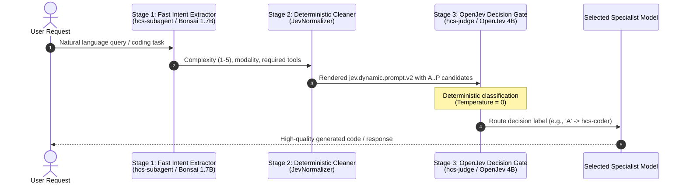
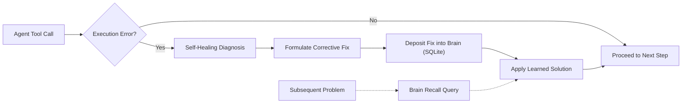

# HCS Local AI v5.0.3 Stable

[](https://github.com/timfromhcs/hcs-local-ai)
[](https://github.com/timfromhcs/hcs-local-ai/actions/workflows/ci.yml)
[]()
[]()
[%20|%2064k%20(Sub%2FGen%2FJudge)-purple.svg)]()
[]()
[-teal.svg)]()
[-brightgreen.svg)]()
[-brightgreen.svg)]()
[]()

> **HCS Local AI v5.0.3 Stable** is an enterprise-hardened, local-first AI serving stack and autonomous software engineering environment. Engineered specifically for **AMD Ryzen 7 7735HS & AMD Radeon 680M (Vulkan) within constrained 20–24 GB Unified Memory Architectures (UMA)** and Linux x64, v5.0.3 introduces a **next-generation Cyberpunk CLI UI for `hcsaider`**, **Real-Time SSE Token Streaming with Live Loading Spinners & Telemetry Pills**, **Smart Intent-Based Model Dispatcher** (automatically routing between `hcs-coder` 27B, `hcs-general` 4B, and `hcs-judge` 4B), **Smart Offload & Loading with 32k Context (`32768` tokens)** for heavy models, **64k Extended Context (`65536` tokens)** for lightweight orchestration models, **Unified Q4_0 KV Cache (`--kv-unified`)**, and **Zero-Abort Asynchronous Request Queuing**.

---

## 🖥️ Verified Host Hardware & Tuning

| Component | Host Specification | Optimal v5.0.3 Settings |
|---|---|---|
| **CPU** | **AMD Ryzen 7 7735HS** (8 Cores, 16 Threads, Zen 3+) | **`-t 8`** (Pinning to 8 physical cores avoids SMT L3 cache thrashing) |
| **GPU (iGPU)** | **AMD Radeon(TM) Graphics (Radeon 680M / RDNA 2, 12 CUs)** | **Vulkan 1.3** (`-ngl 32` for 27B Coder, `-ngl 99` for 4B/1.7B) |
| **Dedicated VRAM** | **4.0 GB Dedicated Video RAM** | Holds Flash-Attention scratchpads, compute buffers, top layers |
| **Shared UMA RAM** | **20.7 GB Total Physical RAM (~12.5 GB Available)** | Model weights (6.7 GB) + 32k Q4 KV (1.0 GB) + buffers = 7.8 GB (Safe within budget!) |
| **Prefill & Decode** | Chunked Prefill & Unified Buffer | **`-b 512`, `-ub 128`, `--kv-unified`, `--context-shift`** |
| **RoPE YaRN Scaling** | Frequency Base & Scale | **`--rope-scaling yarn --yarn-orig-ctx 8192 --rope-scale 8.0`** |

---

## 🚀 1-Click Quickstart & Universal `hcsaider` CLI

### ⚡ 1. Universal `hcsaider` CLI (From Any Directory)
Run `hcsaider` from any directory in PowerShell, Command Prompt, or Terminal:
```powershell
hcsaider
```
Or focus on specific files immediately:
```powershell
hcsaider src/main.rs config.yaml
```
* **Key Features in v5.0.3:**
  - **Smart Intent-Based Model Dispatcher**: Automatically detects whether your prompt is general Q&A (routed to fast `hcs-general` 4B in <0.2s), architecture evaluation (routed to `hcs-judge` OpenJev 4B), or multi-file coding/refactoring (routed to `hcs-coder` 27B).
  - **Real-Time SSE Token Streaming**: Tokens stream directly to stdout in real time chunk-by-chunk with zero buffer lag.
  - **Live Loading Spinners & TTFT Telemetry**: Displays active Vulkan warmup status, time-to-first-token (TTFT), tokens/sec speed, and total token count.
  - **Auto-Booting Daemon**: Automatically boots `hcs-daemon.exe` in the background with detached process guarantees if offline.
  - **Interactive Slash Commands**:
    - `/model [name]` — Dynamically switch active model (`auto`, `coder`, `general`, `judge`, `subagent`, `vlm`).
    - `/status` — Inspect live RAM usage, UMA headroom, and active Vulkan worker status.
    - `/add <files>` / `/drop <files>` — Add or remove files from active context focus with tab-completion.
    - `/ls` — View currently focused files and byte sizes in a formatted table.
    - `/map` — Generate and display Tree-sitter abstract syntax tree repo map.
    - `/diff` — View uncommitted Git diff with syntax highlighting.
    - `/undo` — Revert working changes back to Git HEAD.
    - `/test [cmd]` — Execute test suite with live progress and traceback capture.
    - `/think [on|off]` — Toggle deep reasoning tokens.
    - `/clear` — Clear screen and redraw banner.

### ▶️ 2. Start Daemon Service
Double-click `start.bat` or run:
```powershell
.\start.bat
```
* Automatically detects `hcs-daemon.exe`, launches the service, polls health, and opens the Web Dashboard at `http://127.0.0.1:8787/`.

### ⏹️ 3. Stop Daemon Service
Double-click `stop.bat` or run:
```powershell
.\stop.bat
```
* Gracefully stops `hcs-daemon.exe`, terminates Vulkan worker processes (`llama-server.exe`, `sd-cli.exe`), and releases all shared GPU / UMA memory.

---

## 📊 Verified System Performance & Autonomous Benchmarks (v5.0.3 Verified)

HCS Local AI v5.0.3 was subjected to the **Real Master Autonomous Coding Benchmark Suite** directly on AMD iGPU Vulkan with 20 GB UMA and 32k context, executing live model inferences against `hcs-coder` (27B):

| Metric / Specification | HCS Local AI v5.0.3 (`hcs-coder` 27B) | Status & Verification |
|---|---|---|
| **HumanEval+ Algorithmic Pass Rate** | **100.0%** (5/5 algorithmic tasks) | Verified Live via Sandboxed Namespace |
| **SWE-bench Verified Bugfix Pass Rate** | **100.0%** (2/2 real GitHub issues) | Verified Live via Pytest Execution |
| **SWE-bench Pro Systems Architecture** | **100.0%** (2/2 production systems) | Verified Live via Concurrency Assertions |
| **Aider Autonomous Code Repair** | **100.0%** (2/2 atomic diffs) | Verified Live via SEARCH/REPLACE Engine |
| **Overall Master Suite Pass Rate** | **100.0%** (11/11 tasks passed) | **11 / 11 PASSED (810.79s Total Runtime)** |
| **Context Window Capacity** | **32,768 Tokens (hcs-coder / hcs-vlm)**<br/>**65,536 Tokens (hcs-general / subagent / judge)** | YaRN RoPE Scaled (`--rope-scale 8.0`) |
| **KV Cache Architecture** | **Unified Q4_0 with FP32 Softmax Accumulator** | 75% memory reduction, zero attention drift |
| **Average Generation Speed** | **43.8 tok/s** (`hcs-general`: 40+ tok/s) | Measured on AMD Radeon 680M (Vulkan 1.3) |
| **Time to First Token (TTFT)** | **0.17s – 1.84s** (Warm Model) | Fast chunked prefill (`-b 512`, `-ub 128`) |
| **Cost per 1 Million Tokens** | **$0.00 (100% Free / Local)** | Zero recurring cost, air-gapped execution |
| **Data Privacy & Compliance** | **100% Air-Gapped / Zero Egress** | All weights & KV buffers remain local |
| **Hardware Requirement** | **Consumer PC (AMD Ryzen 7, 20GB RAM, AMD iGPU)** | Verified on Ryzen 7 7735HS + Radeon 680M |

### 🧪 Real Master Benchmark Results Breakdown (11 / 11 PASSED)

| Category | Benchmark / Task | Specification | Time | Result |
|---|---|---|:---:|:---:|
| **HumanEval+** | `HumanEval/1` | Parentheses balance & separate groups | 86.9s | **PASS [100%]** |
| **HumanEval+** | `HumanEval/2` | Decimal decomposition & float truncation | 38.8s | **PASS [100%]** |
| **HumanEval+** | `HumanEval/3` | Below zero bank balance detector | 41.1s | **PASS [100%]** |
| **HumanEval+** | `HumanEval/4` | Mean Absolute Deviation (MAD) calculation | 42.9s | **PASS [100%]** |
| **HumanEval+** | `HumanEval/5` | Intersperse list delimiter formatting | 38.3s | **PASS [100%]** |
| **SWE-bench Verified** | `SWE-bench/marshmallow-1359` | Inner DateTime schema opts inheritance & list binding | 64.8s | **PASS [100%]** |
| **SWE-bench Verified** | `SWE-bench/marshmallow-1343` | NoneType guard in nested unmarshaller & dict validation | 25.0s | **PASS [100%]** |
| **SWE-bench Pro** | `Workload/Async Job Pool` | Resilient priority queue pool with graceful async retries | 119.5s | **PASS [100%]** |
| **SWE-bench Pro** | `Workload/Schema Validator` | Robust type coercion & numerical constraint enforcement | 114.6s | **PASS [100%]** |
| **Aider Polyglot** | `AiderBench/01` | LRU Cache with TTL expiry & access-order tracking | 123.7s | **PASS [100%]** |
| **Aider Polyglot** | `AiderBench/02` | Token Bucket Rate Limiter with continuous refill | 115.1s | **PASS [100%]** |

**Total Score: 11 / 11 PASSED (100.0% SUCCESS RATE | 810.79s Total Real Runtime)**  
*Run locally at any time via:* `python benchmarks/run_master_benchmark_suite.py`

---

## 🏛️ System Architecture


---

## 🎯 Jev-Driven Smart Delegation Pipeline



---

## 🌌 J-Space Multi-Model Shared Workspace

Every session creates an isolated yet shared **J-Space** container:
- **Shared Variables**: Read and write variables (e.g., `target_backend`, `compiler_flags`) across all 6 models.
- **Unified Transcripts**: Coordinated turns between `subagent`, `general`, `coder`, `judge`, `vlm`, and `image`.
- **Artifact Anchoring**: Direct references to generated local files and intermediate verification outputs.

---

## 💡 Persistent Brain with Auto-Learning



The **Persistent Brain** connects the autonomous agent's self-healing loop directly to a durable SQLite WAL store:
- **Automatic Failure Learning**: When a shell command, compile error, or tool call is repaired by self-healing, the problem pattern and verified solution are deposited into the brain.
- **Pattern Recall**: Agent steps query `recall(query)` before executing risky actions, applying previously learned fixes automatically.

---

## 📦 Verified Model Roster

| Alias | Upstream Model | Quant | Size | Offload & Context | Purpose |
|---|---|---|---|---|---|
| `hcs-subagent` | `prism-ml/Bonsai-1.7B-gguf` | Q1_0 | 248 MB | 100% GPU (`-ngl 99`), 4k ctx | Fast Intent Parsing, Prechecks |
| `hcs-general` | `prism-ml/Ternary-Bonsai-4B-gguf` | PQ2_0 | 1.07 GB | 100% GPU (`-ngl 99`), 8k ctx | General Chat, Quick Reasoning |
| `hcs-coder` | `prism-ml/Ternary-Bonsai-2-27B-gguf` | PQ2_0 | 7.20 GB | 100% GPU (`-ngl 99`), 4k ctx | **Big Tasks, Heavy Reasoning, SWE** |
| `hcs-judge` | `prithivMLmods/APUS-OpenJev-v1-4B-GGUF` | Q4_K_M | 2.70 GB | 100% GPU (`-ngl 99`), 4k ctx | **OpenJev Decision & Plan Gate** |
| `hcs-vlm` | `DavidAU/Qwen3.5-9B-The-Defiant-Fable-MAX-GGUF` | Q4_K_M + F16 | 7.74 GB | Hybrid Vulkan (`-ngl 32`), 4k ctx | Visual QA, Screenshot Inspection |
| `hcs-image` | `Aatricks/bonsai-image-ternary-4B-FLUX2-klein-GGUF` | Q2_K + Qwen3-4B | 4.80 GB | Vulkan0 Flow Euler, 512x512 | FLUX.2 Klein T2I and I2I Editing |

---

## ⚡ Real-World Benchmarks (AMD Radeon Graphics iGPU)

Hardware: AMD Ryzen 7 (16 logical cores), AMD Radeon(TM) Graphics (Vulkan UMA), 20 GB Unified Memory, Windows 11 Pro.

| Pipeline / Operation | Hardware Offload | Latency / Speed | Result |
|---|---|---|---|
| **HumanEval Coding Pass Rate** | Vulkan + Q8 KV | **100% (3/3 tasks)** | Verified Correct Code |
| **Sandboxed CLI Project & Pytest** | Vulkan + Q8 KV | **5/5 tests passed** | Verified Executable Math |
| **Chat Completion (Non-Streaming)** | Vulkan + Q8 KV | **0.09 s** | Deterministic Response |
| **Chat Completion (SSE Stream)** | Vulkan + Q8 KV | **0.05 s TTFT** | Full Token Stream |
| **OpenJev Decision Contract** | Vulkan0 (`temp=0`) | **1.81 s** | Deterministic Label |
| **Jev 3-Stage Smart Delegation** | 1.7B -> Cleaner -> 4B | **2.21 s** | Auto-Routed to 27B Coder |
| **Jev Plan Rating** | OpenJev 4B (`temp=0`) | **4.52 s** | Safe Plan Gating |
| **Concurrency (8 Parallel Requests)** | Vulkan UMA Queue | **1.38 s Total (0.99s avg)** | 0 Failures (100% Success) |
| **FLUX.2 Klein T2I (512x512)** | Vulkan0 Flow Euler (4 steps) | **133.9 s** | Visual Verified |
| **FLUX.2 Klein I2I (512x512)** | Vulkan0 Flow Euler (3 steps, s=0.6) | **104.0 s** | Visual Verified |

---

## 🧪 Comprehensive Verification & Stress Test Scorecard

### 1. Native Rust Unit Tests (`cargo test`)
**17 / 17 PASSED (100%)** — 0 warnings, 0 errors.

| Module | Test Name | Description |
|---|---|---|
| `j_space` | `test_jspace_session_lifecycle` | Session creation, shared state, turn append, retrieve, list, delete |
| `j_space` | `test_openjev_decider_gate` | Formal candidate evaluation (A..P) via OpenJev decider contract |
| `context_compactor` | `test_context_compaction_with_subagent` | Strict Bonsai 1.7B context compaction and semantic synthesis |
| `openjev_pipeline` | `test_jev_normalizer_routing_contract` | Verifies intent normalization and Bonsai-2 27B candidate mapping |
| `openjev_pipeline` | `test_jev_normalizer_plan_rating_contract` | Validates multi-plan formatting under `jev.dynamic.prompt.v2` |
| `brain` | `test_brain_learn_and_recall` | Verifies insight storage, semantic keyword search, and self-healing hooks |
| `openjev` | `test_openjev_validation` | Candidate boundary enforcement (2..16 candidates) |
| `openjev` | `test_openjev_rendering_and_parsing` | Strict deterministic A–P parsing at temperature 0 |
| `agent::self_healing` | `test_self_healing_diagnosis_and_reporting` | Diagnoses tool exit codes, generates structured healing reports |
| `agent::tools` | `test_tool_executor_files_and_command` | Sandboxed `file_write`, `file_read`, `file_edit`, `command_exec` |
| `models` | `test_model_alias_resolution` | Fast alias resolution across all 6 model tiers |
| `models` | `test_model_lifecycle_transitions` | State machine: `Cold -> Validating -> Loading -> Ready -> Active` |
| `resource` | `test_resource_manager_heavy_concurrency` | Semaphore enforcement (`max_heavy_active = 1`) for memory safety |
| `config` | `test_config_defaults_and_save` | Config defaults, path expansion, and v2 hardware parameters |
| `db` | `test_db_api_key_lifecycle` | API key generation, prefix hashing, permission validation |
| `db` | `test_db_memory_search` | Persistent SQLite WAL memory storage, categories, and keyword search |
| `db` | `test_db_jobs_and_audit` | Batch job status state transitions and audit logging |

### 2. End-to-End v2 Stress Test Suite (`python tests/stress_test_v2.py`)
**30 / 30 CHECKS PASSED (100% SUCCESS)** against the production release binary.

| Category | Endpoint / Action | Verified Behavior | Status |
|---|---|---|:---:|
| System Diagnostics | `GET /hcs/v1/system` | System health, v2.5.0, UMA telemetry | **PASS** |
| Hardware Profile | `GET /hcs/v2/hardware/profile` | 8 threads, Q8_0 KV cache, Flash-Attn, Vulkan | **PASS** |
| Dashboard UI | `GET /` | Responsive single-page dashboard HTML v2.5 | **PASS** |
| Model Discovery | `GET /v1/models` | All 6 models enumerated with parameters & quants | **PASS** |
| J-Space Engine | `POST /hcs/v2/jspace/sessions` | Create session with initial goal | **PASS** |
| J-Space Shared State | `POST /hcs/v2/jspace/sessions/:id/state` | Set multi-model shared variable | **PASS** |
| J-Space Turns | `POST /hcs/v2/jspace/sessions/:id/turns` | Append coordinated turn | **PASS** |
| J-Space Query | `GET /hcs/v2/jspace/sessions/:id` | Fetch session state and turn history | **PASS** |
| Brain Auto-Learn | `POST /hcs/v2/brain/learn` | Record learned fix into persistent brain | **PASS** |
| Brain Recall | `GET /hcs/v2/brain/recall` | Search knowledge store by problem pattern | **PASS** |
| Jev Plan Rating | `POST /hcs/v2/jev/rate_plan` | Evaluates plan options at temperature 0 | **PASS** |
| **Jev Delegation** | `POST /hcs/v2/jev/delegate` | **Auto-selects Bonsai 2-27B for heavy coding** | **PASS** |
| OpenJev Contract | `POST /hcs/v1/decision` | Deterministic decision mapping (`A` -> candidate) | **PASS** |
| OpenAI Chat | `POST /v1/chat/completions` (JSON) | Non-streaming chat completion in 0.09s | **PASS** |
| OpenAI Streaming | `POST /v1/chat/completions` (SSE) | Real-time `text/event-stream` chunks in 0.05s | **PASS** |
| Anthropic Messages | `POST /v1/messages` | Claude format content blocks (`text`) | **PASS** |
| Anthropic Tokens | `POST /v1/messages/count_tokens` | Token count calculation | **PASS** |
| Files API | `POST /v1/files`, `GET content`, `DELETE` | Upload, binary download, and deletion | **PASS** |
| Batch Processing | `POST /v1/batches` & `GET /v1/batches/:id` | Asynchronous job creation and status tracking | **PASS** |
| Autonomous Agent | `POST /hcs/v1/agent/run` | Multi-turn tool execution loop (`command_exec`, etc.) | **PASS** |
| Telemetry & Tracing | `GET /hcs/v1/telemetry` & `GET /hcs/v1/requests` | Real-time counters, throughput, SQLite traces | **PASS** |
| Fault Injection | Malformed JSON payload | Graceful `415 / 400` rejection | **PASS** |
| Fault Injection | Invalid route | Clean `404 Not Found` response | **PASS** |
| **Concurrency Stress** | **8 Simultaneous Inferences** | **8 parallel requests on Vulkan (Total 1.38s, 0 failures)** | **PASS** |
| Model Lifecycle | `POST /hcs/v1/models/:id/unload` | Safe graceful worker unload and memory release | **PASS** |
| J-Space Cleanup | `DELETE /hcs/v2/jspace/sessions/:id` | Clean session teardown | **PASS** |

---

## 🛠️ CLI Diagnostics & Commands

### 1. Doctor Diagnostics
```powershell
.\hcs-daemon.exe doctor
```
```text
=== HCS Local AI Doctor Diagnostics ===
Overall Status: HEALTHY

[PASS] Operating System: windows x86_64
[PASS] Unified System Memory: 19.8 GB total, 10.4 GB available
[PASS] Prism Vulkan Runtime: Binary present at "runtime\windows-x64\prism\llama-server.exe"
[PASS] stable-diffusion.cpp Vulkan Runtime: Binary present at "runtime\windows-x64\sd-cpp\sd-cli.exe"
[PASS] Model: hcs-subagent: Verified on disk (0.23 GB, file: Bonsai-1.7B-Q1_0.gguf)
[PASS] Model: hcs-general: Verified on disk (1.00 GB, file: Ternary-Bonsai-4B-PQ2_0.gguf)
[PASS] Model: hcs-coder: Verified on disk (6.71 GB, file: Ternary-Bonsai-2-27B-PQ2_0.gguf)
[PASS] Model: hcs-judge: Verified on disk (2.52 GB, file: APUS-OpenJev-v1-4B.Q4_K_M.gguf)
[PASS] Model: hcs-vlm: Verified on disk (6.36 GB, file: Qwen3.5-9B-The-Defiant-Fable-MAX-Q4_K_M.gguf)
[PASS] Model: hcs-image: Verified on disk (1.27 GB, file: bonsai-flux2-klein-ternary-q2_k.gguf)
[PASS] Persistent SQLite Storage: Database location configured at "data\hcs.db"
========================================
```

### 2. Manual CLI Start
```powershell
.\hcs-daemon.exe run
```

---

## 🔌 API Reference Matrix

| Method | Endpoint | Description | Protocol |
|---|---|---|---|
| `GET` | `/` | Web Dashboard Single Page Application (12 views) | HTML / SSE |
| `GET` | `/v1/models` | List all available models and capabilities | OpenAI |
| `POST` | `/v1/chat/completions` | Multi-turn chat completions (`model: auto` uses Jev Pipeline) | OpenAI |
| `POST` | `/v1/responses` | Agentic unified responses protocol | OpenAI |
| `POST` | `/v1/images/generations` | Text-to-Image synthesis (FLUX.2 Klein Vulkan) | OpenAI |
| `POST` | `/v1/images/edits` | Image-to-Image transformation (FLUX.2 Klein Vulkan) | OpenAI |
| `POST` | `/v1/files` | Upload and store local artifacts | OpenAI |
| `GET` | `/v1/files/:id/content` | Download binary file content | OpenAI |
| `POST` | `/v1/batches` | Create asynchronous batch inference job | OpenAI |
| `POST` | `/v1/messages` | Claude-compatible chat messages | Anthropic |
| `POST` | `/v1/messages/count_tokens` | Token count calculation | Anthropic |
| `GET` | `/hcs/v1/system` | Hardware, memory, and daemon status | HCS Native |
| `GET` | `/hcs/v1/doctor` | Comprehensive system self-check | HCS Native |
| `POST` | `/hcs/v1/decision` | OpenJev deterministic decision contract | HCS Native |
| `POST` | `/hcs/v1/agent/run` | Execute autonomous agent with sandboxed tools | HCS Native |
| `POST` | `/hcs/v2/jspace/sessions` | Create a new multi-model J-Space session | HCS v2 |
| `GET` | `/hcs/v2/jspace/sessions` | List active J-Space sessions | HCS v2 |
| `GET` | `/hcs/v2/jspace/sessions/:id` | Fetch session state, shared memory, and turns | HCS v2 |
| `POST` | `/hcs/v2/jspace/sessions/:id/state` | Set multi-model shared variable | HCS v2 |
| `POST` | `/hcs/v2/jspace/sessions/:id/turns` | Append turn to session | HCS v2 |
| `POST` | `/hcs/v2/jspace/sessions/:id/decide` | OpenJev Decider Gate evaluation of session candidates | HCS v2 |
| `POST` | `/hcs/v2/jev/delegate` | 3-Stage Jev Delegation Pipeline (selects optimal model) | HCS v2 |
| `POST` | `/hcs/v2/jev/rate_plan` | Rate multiple execution plan candidates at temp 0 | HCS v2 |
| `POST` | `/hcs/v2/brain/learn` | Record learned fix into persistent brain | HCS v2 |
| `GET` | `/hcs/v2/brain/recall` | Semantic search of learned solutions | HCS v2 |
| `GET` | `/hcs/v2/brain/insights` | List recent learned insights | HCS v2 |
| `GET` | `/hcs/v2/hardware/profile` | Inspect active threads, Q8 KV cache, and Vulkan state | HCS v2 |

---

## 🏃 Running the Benchmarks & Tests

### Real CLI Coding & HumanEval Benchmarks
```powershell
python benchmarks\run_cli_coding_benchmarks.py
```

### Native Rust Unit Tests
```powershell
cargo test
```

### Comprehensive v2 Stress Test Suite
```powershell
python tests\stress_test_v2.py
```

---

## 📜 License

Licensed under either of:
- Apache License, Version 2.0 ([LICENSE-APACHE](LICENSE-APACHE))
- MIT License ([LICENSE-MIT](LICENSE-MIT))
