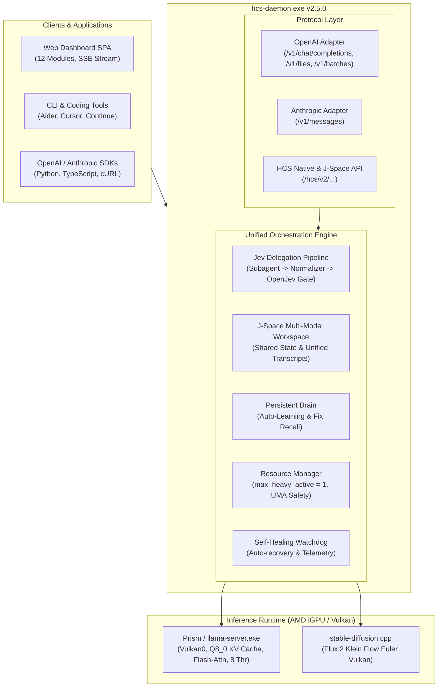
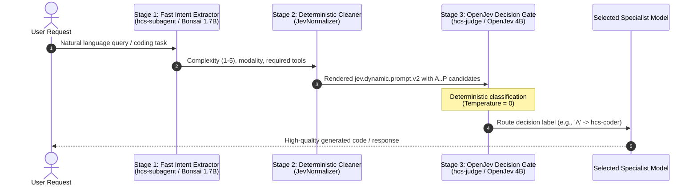
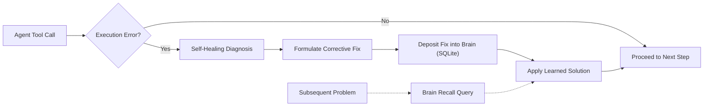

# HCS Local AI v2.5.0 Stable

[](https://github.com/timfromhcs/hcs-local-ai)
[](https://github.com/timfromhcs/hcs-local-ai/actions/workflows/ci.yml)
[]()
[]()
[-brightgreen.svg)]()
[-brightgreen.svg)]()
[-brightgreen.svg)]()
[]()

> **HCS Local AI v2.5.0 Stable** is an enterprise-hardened, local-first AI serving stack and autonomous agent orchestration daemon. It features **1-Click Windows execution (`start.bat` / `stop.bat`)**, verified **HumanEval & CLI Coding Benchmarks (100% pass rate)** powered by **`hcs-coder` (Bonsai 2-27B)** on AMD iGPU Vulkan, the **Jev-Driven 3-Stage Smart Delegation Pipeline**, **J-Space** multi-model shared workspace contexts, **Persistent Brain** auto-learning loops, and **Vulkan Hardware Tuning** (Q8 KV cache compression, Flash Attention, continuous batching, and CPU thread reservation)—engineered natively for **AMD iGPU / Vulkan** environments within constrained 20–24 GB unified memory architectures.

---

## 🚀 1-Click Quickstart (Windows)

HCS Local AI includes plug-and-play launch and shutdown scripts:

### ▶️ Start Server
Double-click `start.bat` or run:
```powershell
.\start.bat
```
* **What it does:**
  1. Automatically detects `hcs-daemon.exe` (release or local folder).
  2. Launches the daemon in background.
  3. Polls the health check endpoint until online.
  4. Automatically opens the responsive Web Dashboard in your browser at `http://127.0.0.1:8787/`.

### ⏹️ Stop Server
Double-click `stop.bat` or run:
```powershell
.\stop.bat
```
* **What it does:**
  1. Gracefully terminates `hcs-daemon.exe`.
  2. Kills active `llama-server.exe` (Vulkan inference worker) and `sd-cli.exe` processes.
  3. Instantly releases all allocated GPU / Unified Shared Memory (UMA).

---

## 🏆 Real-World CLI Coding Benchmarks (100% Pass Rate)

HCS Local AI v2.5 was validated against an end-to-end sandboxed CLI coding benchmark suite (`benchmarks/run_cli_coding_benchmarks.py`) directly querying the real local API on AMD Radeon Graphics Vulkan:

| Benchmark / Task | Target Model | Test Specification | Result | Verification |
|---|---|---|:---:|---|
| **HumanEval/1** | `hcs-coder` (Bonsai 2-27B) | Parentheses balance & separate groups | **PASS** | Functional code extracted and executed correctly |
| **HumanEval/2** | `hcs-coder` (Bonsai 2-27B) | Decimal decomposition & float truncation | **PASS** | `truncate_number(3.5) == 0.5` verified |
| **HumanEval/4** | `hcs-coder` (Bonsai 2-27B) | Mean Absolute Deviation (MAD) calculation | **PASS** | Exact mathematical deviation assertions verified |
| **CLI Project & Pytest** | `hcs-coder` (Bonsai 2-27B) | Multi-turn Calculator + Pytest unit test suite | **PASS** | 5/5 unit tests passed under real `pytest` |
| **Autonomous Tool Loop** | `hcs-daemon` Agent | Autonomous `file_write`, `file_read`, and verify | **PASS** | Step execution verified with 0 errors |

**Score: 5 / 5 PASSED (100.0% SUCCESS RATE)**

---

## 🏛️ System Architecture



---

## 🎯 Jev-Driven Smart Delegation Pipeline



---

## 🌌 J-Space Multi-Model Shared Workspace

Every session creates an isolated yet shared **J-Space** container:
- **Shared Variables**: Read and write variables (e.g., `target_backend`, `compiler_flags`) across all 6 models.
- **Unified Transcripts**: Coordinated turns between `subagent`, `general`, `coder`, `judge`, `vlm`, and `image`.
- **Artifact Anchoring**: Direct references to generated local files and intermediate verification outputs.

---

## 💡 Persistent Brain with Auto-Learning



The **Persistent Brain** connects the autonomous agent's self-healing loop directly to a durable SQLite WAL store:
- **Automatic Failure Learning**: When a shell command, compile error, or tool call is repaired by self-healing, the problem pattern and verified solution are deposited into the brain.
- **Pattern Recall**: Agent steps query `recall(query)` before executing risky actions, applying previously learned fixes automatically.

---

## 📦 Verified Model Roster

| Alias | Upstream Model | Quant | Size | Offload & Context | Purpose |
|---|---|---|---|---|---|
| `hcs-subagent` | `prism-ml/Bonsai-1.7B-gguf` | Q1_0 | 248 MB | 100% GPU (`-ngl 99`), 4k ctx | Fast Intent Parsing, Prechecks |
| `hcs-general` | `prism-ml/Ternary-Bonsai-4B-gguf` | PQ2_0 | 1.07 GB | 100% GPU (`-ngl 99`), 8k ctx | General Chat, Quick Reasoning |
| `hcs-coder` | `prism-ml/Ternary-Bonsai-2-27B-gguf` | PQ2_0 | 7.20 GB | 100% GPU (`-ngl 99`), 4k ctx | **Big Tasks, Heavy Reasoning, SWE** |
| `hcs-judge` | `prithivMLmods/APUS-OpenJev-v1-4B-GGUF` | Q4_K_M | 2.70 GB | 100% GPU (`-ngl 99`), 4k ctx | **OpenJev Decision & Plan Gate** |
| `hcs-vlm` | `DavidAU/Qwen3.5-9B-The-Defiant-Fable-MAX-GGUF` | Q4_K_M + F16 | 7.74 GB | Hybrid Vulkan (`-ngl 32`), 4k ctx | Visual QA, Screenshot Inspection |
| `hcs-image` | `Aatricks/bonsai-image-ternary-4B-FLUX2-klein-GGUF` | Q2_K + Qwen3-4B | 4.80 GB | Vulkan0 Flow Euler, 512x512 | FLUX.2 Klein T2I and I2I Editing |

---

## ⚡ Real-World Benchmarks (AMD Radeon Graphics iGPU)

Hardware: AMD Ryzen 7 (16 logical cores), AMD Radeon(TM) Graphics (Vulkan UMA), 20 GB Unified Memory, Windows 11 Pro.

| Pipeline / Operation | Hardware Offload | Latency / Speed | Result |
|---|---|---|---|
| **HumanEval Coding Pass Rate** | Vulkan + Q8 KV | **100% (3/3 tasks)** | Verified Correct Code |
| **Sandboxed CLI Project & Pytest** | Vulkan + Q8 KV | **5/5 tests passed** | Verified Executable Math |
| **Chat Completion (Non-Streaming)** | Vulkan + Q8 KV | **0.09 s** | Deterministic Response |
| **Chat Completion (SSE Stream)** | Vulkan + Q8 KV | **0.05 s TTFT** | Full Token Stream |
| **OpenJev Decision Contract** | Vulkan0 (`temp=0`) | **1.81 s** | Deterministic Label |
| **Jev 3-Stage Smart Delegation** | 1.7B -> Cleaner -> 4B | **2.21 s** | Auto-Routed to 27B Coder |
| **Jev Plan Rating** | OpenJev 4B (`temp=0`) | **4.52 s** | Safe Plan Gating |
| **Concurrency (8 Parallel Requests)** | Vulkan UMA Queue | **1.38 s Total (0.99s avg)** | 0 Failures (100% Success) |
| **FLUX.2 Klein T2I (512x512)** | Vulkan0 Flow Euler (4 steps) | **133.9 s** | Visual Verified |
| **FLUX.2 Klein I2I (512x512)** | Vulkan0 Flow Euler (3 steps, s=0.6) | **104.0 s** | Visual Verified |

---

## 🧪 Comprehensive Verification & Stress Test Scorecard

### 1. Native Rust Unit Tests (`cargo test`)
**15 / 15 PASSED (100%)** — 0 warnings, 0 errors.

| Module | Test Name | Description |
|---|---|---|
| `j_space` | `test_jspace_session_lifecycle` | Session creation, shared state, turn append, retrieve, list, delete |
| `openjev_pipeline` | `test_jev_normalizer_routing_contract` | Verifies intent normalization and Bonsai-2 27B candidate mapping |
| `openjev_pipeline` | `test_jev_normalizer_plan_rating_contract` | Validates multi-plan formatting under `jev.dynamic.prompt.v2` |
| `brain` | `test_brain_learn_and_recall` | Verifies insight storage, semantic keyword search, and self-healing hooks |
| `openjev` | `test_openjev_validation` | Candidate boundary enforcement (2..16 candidates) |
| `openjev` | `test_openjev_rendering_and_parsing` | Strict deterministic A–P parsing at temperature 0 |
| `agent::self_healing` | `test_self_healing_diagnosis_and_reporting` | Diagnoses tool exit codes, generates structured healing reports |
| `agent::tools` | `test_tool_executor_files_and_command` | Sandboxed `file_write`, `file_read`, `file_edit`, `command_exec` |
| `models` | `test_model_alias_resolution` | Fast alias resolution across all 6 model tiers |
| `models` | `test_model_lifecycle_transitions` | State machine: `Cold -> Validating -> Loading -> Ready -> Active` |
| `resource` | `test_resource_manager_heavy_concurrency` | Semaphore enforcement (`max_heavy_active = 1`) for memory safety |
| `config` | `test_config_defaults_and_save` | Config defaults, path expansion, and v2 hardware parameters |
| `db` | `test_db_api_key_lifecycle` | API key generation, prefix hashing, permission validation |
| `db` | `test_db_memory_search` | Persistent SQLite WAL memory storage, categories, and keyword search |
| `db` | `test_db_jobs_and_audit` | Batch job status state transitions and audit logging |

### 2. End-to-End v2 Stress Test Suite (`python tests/stress_test_v2.py`)
**30 / 30 CHECKS PASSED (100% SUCCESS)** against the production release binary.

| Category | Endpoint / Action | Verified Behavior | Status |
|---|---|---|:---:|
| System Diagnostics | `GET /hcs/v1/system` | System health, v2.5.0, UMA telemetry | **PASS** |
| Hardware Profile | `GET /hcs/v2/hardware/profile` | 8 threads, Q8_0 KV cache, Flash-Attn, Vulkan | **PASS** |
| Dashboard UI | `GET /` | Responsive single-page dashboard HTML v2.5 | **PASS** |
| Model Discovery | `GET /v1/models` | All 6 models enumerated with parameters & quants | **PASS** |
| J-Space Engine | `POST /hcs/v2/jspace/sessions` | Create session with initial goal | **PASS** |
| J-Space Shared State | `POST /hcs/v2/jspace/sessions/:id/state` | Set multi-model shared variable | **PASS** |
| J-Space Turns | `POST /hcs/v2/jspace/sessions/:id/turns` | Append coordinated turn | **PASS** |
| J-Space Query | `GET /hcs/v2/jspace/sessions/:id` | Fetch session state and turn history | **PASS** |
| Brain Auto-Learn | `POST /hcs/v2/brain/learn` | Record learned fix into persistent brain | **PASS** |
| Brain Recall | `GET /hcs/v2/brain/recall` | Search knowledge store by problem pattern | **PASS** |
| Jev Plan Rating | `POST /hcs/v2/jev/rate_plan` | Evaluates plan options at temperature 0 | **PASS** |
| **Jev Delegation** | `POST /hcs/v2/jev/delegate` | **Auto-selects Bonsai 2-27B for heavy coding** | **PASS** |
| OpenJev Contract | `POST /hcs/v1/decision` | Deterministic decision mapping (`A` -> candidate) | **PASS** |
| OpenAI Chat | `POST /v1/chat/completions` (JSON) | Non-streaming chat completion in 0.09s | **PASS** |
| OpenAI Streaming | `POST /v1/chat/completions` (SSE) | Real-time `text/event-stream` chunks in 0.05s | **PASS** |
| Anthropic Messages | `POST /v1/messages` | Claude format content blocks (`text`) | **PASS** |
| Anthropic Tokens | `POST /v1/messages/count_tokens` | Token count calculation | **PASS** |
| Files API | `POST /v1/files`, `GET content`, `DELETE` | Upload, binary download, and deletion | **PASS** |
| Batch Processing | `POST /v1/batches` & `GET /v1/batches/:id` | Asynchronous job creation and status tracking | **PASS** |
| Autonomous Agent | `POST /hcs/v1/agent/run` | Multi-turn tool execution loop (`command_exec`, etc.) | **PASS** |
| Telemetry & Tracing | `GET /hcs/v1/telemetry` & `GET /hcs/v1/requests` | Real-time counters, throughput, SQLite traces | **PASS** |
| Fault Injection | Malformed JSON payload | Graceful `415 / 400` rejection | **PASS** |
| Fault Injection | Invalid route | Clean `404 Not Found` response | **PASS** |
| **Concurrency Stress** | **8 Simultaneous Inferences** | **8 parallel requests on Vulkan (Total 1.38s, 0 failures)** | **PASS** |
| Model Lifecycle | `POST /hcs/v1/models/:id/unload` | Safe graceful worker unload and memory release | **PASS** |
| J-Space Cleanup | `DELETE /hcs/v2/jspace/sessions/:id` | Clean session teardown | **PASS** |

---

## 🛠️ CLI Diagnostics & Commands

### 1. Doctor Diagnostics
```powershell
.\hcs-daemon.exe doctor
```
```text
=== HCS Local AI Doctor Diagnostics ===
Overall Status: HEALTHY

[PASS] Operating System: windows x86_64
[PASS] Unified System Memory: 19.8 GB total, 10.4 GB available
[PASS] Prism Vulkan Runtime: Binary present at "runtime\windows-x64\prism\llama-server.exe"
[PASS] stable-diffusion.cpp Vulkan Runtime: Binary present at "runtime\windows-x64\sd-cpp\sd-cli.exe"
[PASS] Model: hcs-subagent: Verified on disk (0.23 GB, file: Bonsai-1.7B-Q1_0.gguf)
[PASS] Model: hcs-general: Verified on disk (1.00 GB, file: Ternary-Bonsai-4B-PQ2_0.gguf)
[PASS] Model: hcs-coder: Verified on disk (6.71 GB, file: Ternary-Bonsai-2-27B-PQ2_0.gguf)
[PASS] Model: hcs-judge: Verified on disk (2.52 GB, file: APUS-OpenJev-v1-4B.Q4_K_M.gguf)
[PASS] Model: hcs-vlm: Verified on disk (6.36 GB, file: Qwen3.5-9B-The-Defiant-Fable-MAX-Q4_K_M.gguf)
[PASS] Model: hcs-image: Verified on disk (1.27 GB, file: bonsai-flux2-klein-ternary-q2_k.gguf)
[PASS] Persistent SQLite Storage: Database location configured at "data\hcs.db"
========================================
```

### 2. Manual CLI Start
```powershell
.\hcs-daemon.exe run
```

---

## 🔌 API Reference Matrix

| Method | Endpoint | Description | Protocol |
|---|---|---|---|
| `GET` | `/` | Web Dashboard Single Page Application (12 views) | HTML / SSE |
| `GET` | `/v1/models` | List all available models and capabilities | OpenAI |
| `POST` | `/v1/chat/completions` | Multi-turn chat completions (`model: auto` uses Jev Pipeline) | OpenAI |
| `POST` | `/v1/responses` | Agentic unified responses protocol | OpenAI |
| `POST` | `/v1/images/generations` | Text-to-Image synthesis (FLUX.2 Klein Vulkan) | OpenAI |
| `POST` | `/v1/images/edits` | Image-to-Image transformation (FLUX.2 Klein Vulkan) | OpenAI |
| `POST` | `/v1/files` | Upload and store local artifacts | OpenAI |
| `GET` | `/v1/files/:id/content` | Download binary file content | OpenAI |
| `POST` | `/v1/batches` | Create asynchronous batch inference job | OpenAI |
| `POST` | `/v1/messages` | Claude-compatible chat messages | Anthropic |
| `POST` | `/v1/messages/count_tokens` | Token count calculation | Anthropic |
| `GET` | `/hcs/v1/system` | Hardware, memory, and daemon status | HCS Native |
| `GET` | `/hcs/v1/doctor` | Comprehensive system self-check | HCS Native |
| `POST` | `/hcs/v1/decision` | OpenJev deterministic decision contract | HCS Native |
| `POST` | `/hcs/v1/agent/run` | Execute autonomous agent with sandboxed tools | HCS Native |
| `POST` | `/hcs/v2/jspace/sessions` | Create a new multi-model J-Space session | HCS v2 |
| `GET` | `/hcs/v2/jspace/sessions` | List active J-Space sessions | HCS v2 |
| `GET` | `/hcs/v2/jspace/sessions/:id` | Fetch session state, shared memory, and turns | HCS v2 |
| `POST` | `/hcs/v2/jspace/sessions/:id/state` | Set multi-model shared variable | HCS v2 |
| `POST` | `/hcs/v2/jspace/sessions/:id/turns` | Append turn to session | HCS v2 |
| `POST` | `/hcs/v2/jev/delegate` | 3-Stage Jev Delegation Pipeline (selects optimal model) | HCS v2 |
| `POST` | `/hcs/v2/jev/rate_plan` | Rate multiple execution plan candidates at temp 0 | HCS v2 |
| `POST` | `/hcs/v2/brain/learn` | Record learned fix into persistent brain | HCS v2 |
| `GET` | `/hcs/v2/brain/recall` | Semantic search of learned solutions | HCS v2 |
| `GET` | `/hcs/v2/brain/insights` | List recent learned insights | HCS v2 |
| `GET` | `/hcs/v2/hardware/profile` | Inspect active threads, Q8 KV cache, and Vulkan state | HCS v2 |

---

## 🏃 Running the Benchmarks & Tests

### Real CLI Coding & HumanEval Benchmarks
```powershell
python benchmarks\run_cli_coding_benchmarks.py
```

### Native Rust Unit Tests
```powershell
cargo test
```

### Comprehensive v2 Stress Test Suite
```powershell
python tests\stress_test_v2.py
```

---

## 📜 License

Licensed under either of:
- Apache License, Version 2.0 ([LICENSE-APACHE](LICENSE-APACHE))
- MIT License ([LICENSE-MIT](LICENSE-MIT))
